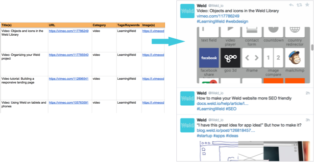

# Smart Social Scheduler

Never run dry - keeps your social feeds loaded with your best content. Powered by [Buffer](https://www.buffer.com), and requires a Buffer account.

## How to Run

### Schedule updates

	node app/update.js

### Web server for REST API

Just start with:

	# Set password used in API requests
	export SSS_PASSWORD=MYPASSWORD
	export BUFFER_ACCESS_TOKEN=[token]

	grunt

Server will default to **http://localhost:3009**

## Concepts

These data are stored in the database:

* **Articles**. This is what you input into the Smart Social Scheduler. Properties include a `url` (unique), arrays of `titles` and `images` that will be chosen randomly, and (hash)`tags` where all will be used if they fit.
* **Updates**. These are time-stamped posts to your social accounts. Can be used for follow-up analytics.
* **Profiles**. Social accounts e.g. for Twitter, Facebook, etc. Smart Social Scheduler will read your profiles from your Buffer account.

## API

List articles

	curl http://localhost:3009/api/articles?password=MYPASSWORD

Create new article:

	curl -X POST -H "Content-Type: application/json" -d '{ ... }' http://localhost:3009/api/articles?password=MYPASSWORD

Update article:

	curl -X PUT -H "Content-Type: application/json" -d '{ ... }' http://localhost:3009/api/articles/548cbb2b1ad50708212193d8?password=MYPASSWORD

Delete article:

	curl -X DELETE http://localhost:3009/api/articles/5477a6f88906b9fc766c843e?password=MYPASSWORD

Delete all articles:

	curl -X DELETE http://localhost:3009/api/articles/ALL?password=MYPASSWORD

## Settings

* **SSS_QUEUE_LIMIT**: 1-10 Buffer queue size.
* **SSS_PASSWORD**: for use in API requests.
* **BUFFER_ACCESS_TOKEN**: for Buffer API.

## Implementation

Based on the [Yeoman Express generator](https://github.com/petecoop/generator-express) with the "MVC" option.
Built on Node.js, Express (with EJS) and MongoDB.

## Deploying on Heroku

	# Set up and configure app
	heroku create MYAPPNAME
	heroku addons:create mongolab

	# Settings
	heroku config:set BUFFER_ACCESS_TOKEN=(token)
	heroku config:set SSS_PASSWORD=MYPASSWORD
	heroku config:set SSS_QUEUE_LIMIT=3

Designed to be used with [Heroku Scheduler](https://devcenter.heroku.com/articles/scheduler), but can also be triggered manually:

	heroku run node app/update.js
